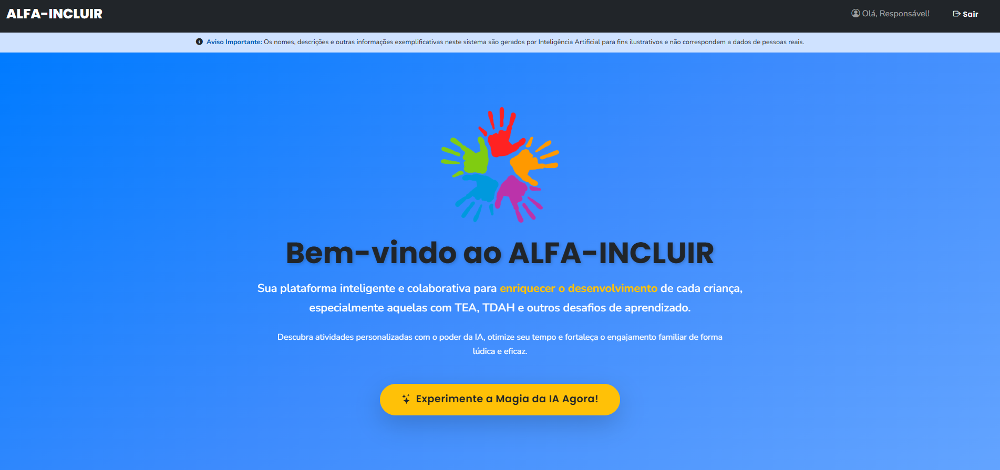
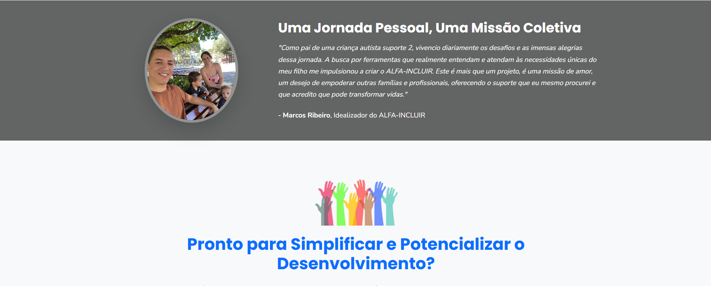
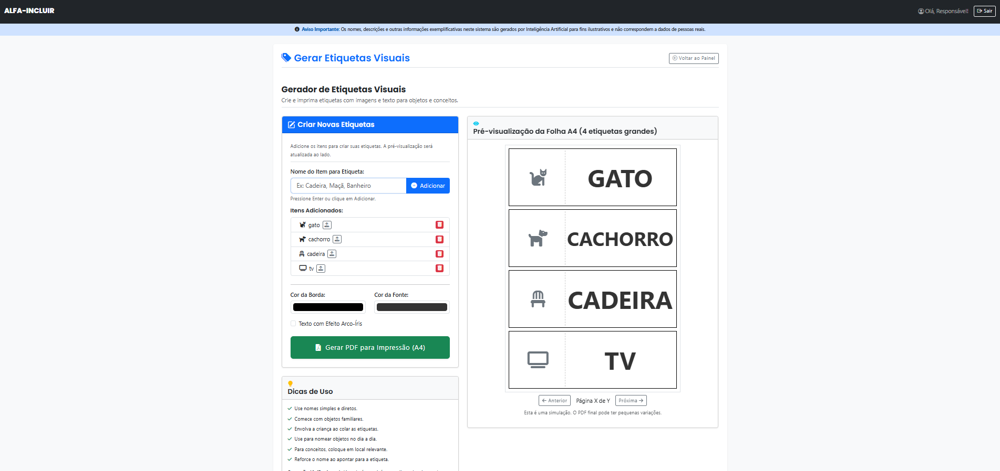
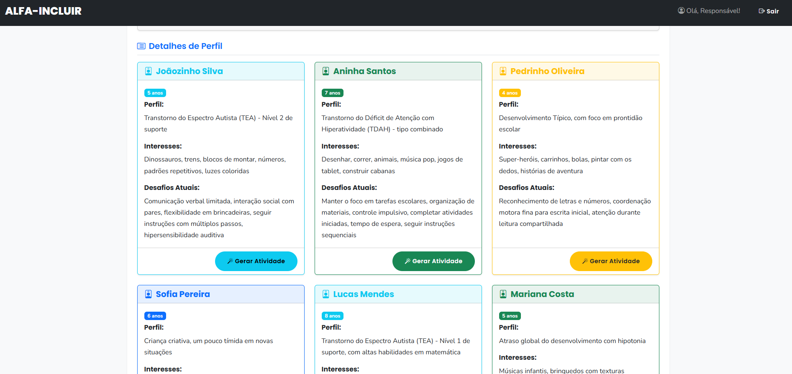
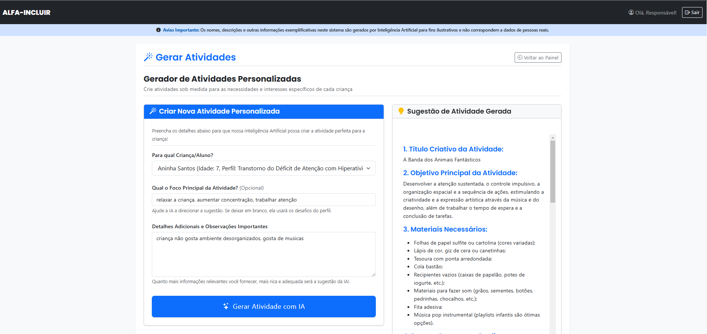
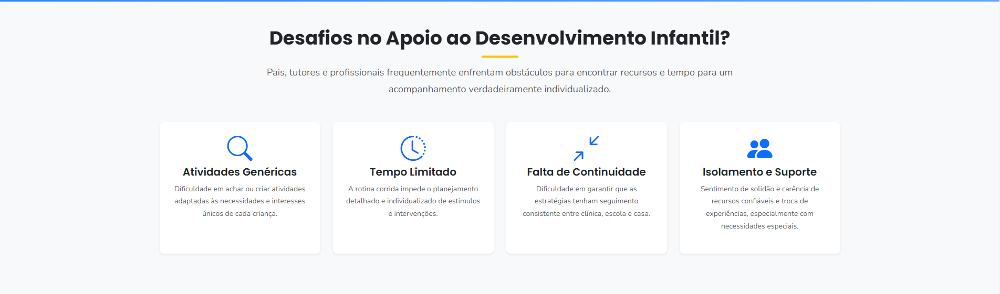

# ALFA-INCLUIR: Demonstração de Ferramentas de Apoio ao Desenvolvimento Infantil 🚀

 
*Clique na imagem acima para ver uma demonstração do projeto em ação! 

---

## Sobre o Projeto

O ALFA-INCLUIR nasceu da jornada pessoal de um pai em busca de ferramentas eficazes para o desenvolvimento de seu filho autista grau 3. É mais que um projeto; é uma missão de amor para empoderar outras famílias e profissionais, oferecendo suporte prático e inteligente, com foco em atividades personalizadas e recursos visuais.

*"Como pai de uma criança autista grau 3, vivencio diariamente os desafios e as imensas alegrias dessa jornada. A busca por ferramentas que realmente entendam e atendam às necessidades únicas do meu filho me impulsionou a criar o ALFA-INCLUIR."* - Marcos Ribeiro, Idealizador.

---

## ✨ Funcionalidades em Destaque

Esta demonstração explora o potencial de uma plataforma integrada para auxiliar no dia a dia:

### 1. Gerador de Atividades Personalizadas com IA
Crie atividades sob medida, utilizando a inteligência artificial (via Google Gemini) para adaptar sugestões ao perfil, interesses e desafios específicos de cada criança.

### 2. Gerador de Etiquetas Visuais
Uma ferramenta intuitiva para criar e imprimir etiquetas com nomes, ícones/imagens e descrições (sugeridas ou manuais) para objetos e conceitos, auxiliando na comunicação e aprendizado.

### 3. Gerenciamento de Perfis (Filhos/Alunos)
Cadastre e gerencie perfis detalhados, incluindo idade, diagnóstico (se houver), interesses e desafios, para que as ferramentas possam oferecer sugestões ainda mais precisas.

### 4. Conexão com API Externa (Google Gemini)
A funcionalidade de IA requer que o usuário (na demonstração) insira sua própria chave da API Google Gemini, garantindo que o uso seja personalizado e controlado.

### 5. Dashboard Intuitivo e Recursos Adicionais
Navegue facilmente pelas funcionalidades através de um painel de controle amigável e acesse uma seção de recursos e dicas (placeholder para futuras expansões).

 

---

## 🚀 Como Usar

### Opção 1: Acesso à Versão Web (Online)
Experimente rapidamente a demonstração hospedada:
*   **URL:** [http://xportall.com.br:1010/alfa-incluir-demo-php/](http://xportall.com.br:1010/alfa-incluir-demo-php/)

### Opção 2: Executar Localmente com XAMPP
Siga as instruções detalhadas no arquivo:
👉 **[instalação_importante.md](instalação_importante.md)** 👈

Este arquivo contém todos os passos para configurar o XAMPP, o projeto e a chave da API Google Gemini em sua máquina local.

---

## A Missão ALFA-INCLUIR

Este projeto é movido pela paixão de criar um futuro mais inclusivo e capacitador para todas as crianças.

## Estrutura do Projeto
*   `/alfa-incluir-demo-php/`: Contém todos os arquivos PHP, JS, CSS e assets do projeto web.
*   `README.md`: Este arquivo de apresentação.
*   `instalacao_importante.md`: Guia detalhado de instalação local.
*   `*.png`: Imagens de tela usadas nesta documentação (localizadas na raiz do repositório).

---
*Este é um projeto de demonstração. As funcionalidades e o design estão em constante evolução.*

# ✨ ALFA-INCLUIR ✨

**Empoderando o Desenvolvimento Infantil com Inteligência Artificial, Amor e Compreensão.**

---

## 🌟 Nossa Essência

Bem-vindo ao ALFA-INCLUIR! Nossa plataforma inteligente e colaborativa nasceu da necessidade e do amor, com a missão de **enriquecer o desenvolvimento** de cada criança. Queremos ser seu parceiro, oferecendo ferramentas que simplificam o planejamento e potencializam o aprendizado, especialmente para crianças com Transtorno do Espectro Autista (TEA), TDAH e outros desafios.

Com o ALFA-INCLUIR, você descobrirá atividades personalizadas com o poder da IA, otimizará seu tempo e fortalecerá o engajamento familiar de forma lúdica e eficaz.

**[➡️ Experimente a Magia da IA Agora no nosso Demo Online!](http://xportall.com.br:1010/alfa-incluir-demo-php/)**

---

## 💔 O Desafio Diário: Uma Realidade que Conhecemos

Como pai de uma criança diagnosticada com Transtorno do Espectro Autista (TEA) nível 2 de suporte, conheço em primeira mão os obstáculos e as buscas incessantes por recursos que verdadeiramente façam a diferença. A jornada para apoiar o desenvolvimento infantil, embora repleta de amor, frequentemente nos apresenta:

*   🤯 **A Busca por Atividades Realmente Adaptadas:** Encontrar ou criar atividades que cativem o interesse e atendam às necessidades específicas de uma criança no espectro pode ser um quebra-cabeça exaustivo. Atividades genéricas raramente surtem o efeito desejado.
*   ⏳ **O Tempo que Escapa por Entre os Dedos:** A rotina corrida de pais, tutores e terapeutas muitas vezes não permite o tempo necessário para um planejamento detalhado e individualizado de estímulos, resultando em oportunidades perdidas.
*   🔄 **A Quebra na Continuidade do Cuidado:** Garantir que as estratégias e aprendizados tenham um seguimento consistente entre os diferentes ambientes – casa, escola, terapia – é um desafio logístico e de comunicação constante.
*   🤝 **O Sentimento de Isolamento e a Carência de Suporte Confiável:** Muitas famílias e profissionais se sentem sozinhos, ansiando por recursos validados e uma comunidade para trocar experiências e encontrar apoio mútuo.

---

## 🚀 Nossa Solução: ALFA-INCLUIR - Inteligência Artificial com Coração

O ALFA-INCLUIR não é apenas uma plataforma; é uma promessa de apoio, nascida da experiência e impulsionada pela tecnologia. Queremos ser a ponte que **conecta** conhecimento especializado à prática diária e **capacita** você a fazer a diferença.

**Como Fazemos a Mágica Acontecer em 3 Passos Simples:**

1.  **📝 Você nos Conta Sobre a Criança (O Perfil Detalhado):**
    Com sensibilidade e foco no que realmente importa, você descreve a criança: sua idade, seus **interesses apaixonantes**, suas habilidades já conquistadas, os **desafios** que queremos superar juntos e, se aplicável, informações sobre diagnóstico e nível de suporte. Quanto mais detalhes você compartilha, mais precisa e encantadora será a "mágica" da nossa IA.

2.  🤖 **Nossa IA (Google Gemini) Entra em Ação:**
    Utilizamos o poder avançado da Inteligência Artificial do Google Gemini. Nossa IA analisa as informações fornecidas e, cruzando-as com um vasto conhecimento em desenvolvimento infantil, pedagogia e práticas terapêuticas, gera sugestões de atividades lúdicas, de estímulo e pedagógicas personalizadas.

3.  💡 **Atividades Criativas e Sob Medida na Palma da Sua Mão:**
    Você recebe planos de atividades prontas para aplicar, ricas em detalhes, criativas e cuidadosamente adaptadas ao perfil único da criança. Priorizamos o uso de materiais acessíveis e um forte foco no engajamento familiar e terapêutico, transformando cada momento em uma oportunidade de aprendizado e conexão.

---

## 🧩 Desvendando o Espectro Autista com Empatia e Conhecimento

Compreender para incluir: essa é a nossa filosofia. Cada indivíduo no espectro autista possui uma forma singular, bela e valiosa de perceber e interagir com o mundo. No ALFA-INCLUIR, celebramos a neurodiversidade e buscamos oferecer clareza e apoio:

*   🧠 **Neurodiversidade em Foco:** O TEA é uma variação natural do desenvolvimento neurológico, não uma doença ou falha. Entender e celebrar as diferentes formas de pensar e ser é o primeiro passo para uma sociedade verdadeiramente inclusiva.
*   💬 **Comunicação Plural e Rica:** A comunicação vai muito além da fala verbal. Gestos, expressões faciais, o brilho nos olhos, sistemas de comunicação alternativa e aumentativa (PECS, pranchas de comunicação) são ferramentas valiosas e ricas de expressão que devem ser valorizadas e incentivadas.
*   🌟 **Interesses como Superpoderes:** O hiperfoco, aquela capacidade de imersão profunda em um tema de interesse, frequentemente presente no autismo, não é uma limitação, mas sim um verdadeiro superpoder! Ele pode ser a chave para o aprendizado, canalizando a paixão e a energia da criança para o desenvolvimento de talentos e habilidades incríveis.
*   🎧 **Universo Sensorial Único:** Muitas pessoas no espectro processam estímulos sensoriais (luzes, sons, texturas, cheiros, movimentos) de forma diferente, podendo ser mais ou menos sensíveis. Compreender e adaptar o ambiente com empatia é crucial para promover conforto, segurança, regulação emocional e, consequentemente, aprendizado.

*"Se você conheceu uma pessoa com autismo, você conheceu UMA pessoa com autismo." - Dr. Stephen Shore*

---

## 💖 Uma Jornada Pessoal, Uma Missão Coletiva: A História por Trás do ALFA-INCLUIR

  

"Como pai de uma criança autista incrível, diagnosticada com nível 2 de suporte, vivencio diariamente os desafios e as imensas alegrias que essa jornada única nos proporciona. A busca incessante por ferramentas, estratégias e, acima de tudo, compreensão que realmente atendam às necessidades singulares do meu filho, me impulsionou a idealizar o ALFA-INCLUIR.

Este projeto nasceu da minha experiência, das noites em claro pesquisando, das conversas com terapeutas e educadores, e do desejo ardente de encontrar soluções práticas que pudessem aliviar a sobrecarga e, ao mesmo tempo, potencializar o desenvolvimento do meu filho. O ALFA-INCLUIR é mais do que código e algoritmos; é uma missão de amor, um reflexo da minha vivência e uma tentativa de oferecer a outras famílias e profissionais o tipo de suporte que eu mesmo procurei e que acredito piamente que pode transformar obstáculos em degraus, e desafios em descobertas. Queremos construir uma ponte entre o conhecimento especializado e o dia a dia, usando a tecnologia como aliada para um futuro mais brilhante e inclusivo para todas as crianças."

*- **[Seu Nome Aqui]**, Idealizador do ALFA-INCLUIR*

---

## 🛠️ Funcionalidades Atuais (Demo MVP)

Acesse nosso **[Demo Online](http://xportall.com.br:1010/alfa-incluir-demo-php/)** para ver em ação:

*   Login simulado para perfis: Pai/Cuidador, Profissional, Admin.
*   Dashboard com navegação por cards.
*   Listagem de crianças (dados mockados).
*   **Gerador de Atividades com IA (Google Gemini):** O coração do projeto, gerando sugestões personalizadas.
*   Simulação de feedback e salvamento de atividades.

*(Veja a seção "Como Rodar este Demo Localmente" abaixo se preferir)*

---
## 🔮 Visão Futura | 💻 Tecnologias | 🚀 Como Rodar Localmente | 🙏 Agradecimentos

*(Mantenha as seções "Visão Futura", "Tecnologias Utilizadas", "Como Rodar este Demo Localmente" e "Agradecimentos" como estavam no README anterior, pois já estavam boas e completas).*

---

*Este projeto é uma demonstração e um trabalho em andamento, impulsionado pela paixão de fazer a diferença na vida de crianças e suas famílias.*
